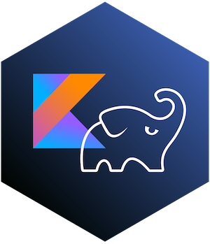

# Gradle Version Catalog Project


This project serves as a Gradle Version Catalog, making it easier to manage and share dependencies and plugins versions across your projects.

## Overview

The Version Catalog is a feature introduced in Gradle 6.9, which allows for centralizing the dependencies and plugins versions in a TOML file. This project uses Gradle 8.1.1 and has the necessary configuration files to create and publish a version catalog.

## Getting Started

### Prerequisites

- Gradle 8.1.1 or later
- Java Development Kit (JDK) 8 or later

### Directory Structure

- `build.gradle.kts`: Contains the configuration for the version catalog and publishing to a Maven repository.
- `settings.gradle.kts`: Contains the plugin and repository configuration.
- `libs.versions.toml`: Contains the version catalog definition in TOML format.

## Configuration

### Defining Versions

Edit `libs.versions.toml` and add your dependencies and plugins with their respective versions under 4 major sections:

the [versions] section is used to declare versions which can be referenced by dependencies

the [libraries] section is used to declare the aliases to coordinates

the [bundles] section is used to declare dependency bundles

the [plugins] section is used to declare plugins

```toml
[versions]
groovy = "3.0.5"
checkstyle = "8.37"

[libraries]
groovy-core = { module = "org.codehaus.groovy:groovy", version.ref = "groovy" }
groovy-json = { module = "org.codehaus.groovy:groovy-json", version.ref = "groovy" }
groovy-nio = { module = "org.codehaus.groovy:groovy-nio", version.ref = "groovy" }
commons-lang3 = { group = "org.apache.commons", name = "commons-lang3", version = { strictly = "[3.8, 4.0[", prefer="3.9" } }

[bundles]
groovy = ["groovy-core", "groovy-json", "groovy-nio"]

[plugins]
versions = { id = "com.github.ben-manes.versions", version = "0.45.0" }
```

### Publishing

This project is configured to publish the version catalog to a Maven repository. You need to provide the URL and credentials for your Maven repository in `build.gradle.kts`.

```kotlin
publishing {
    repositories {
        maven {
            url = uri("https://your.maven-repo.net/repository/maven-releases/")
            credentials {
                val repositoryUsername: String? by project
                val repositoryPassword: String? by project
                username = repositoryUsername
                password = repositoryPassword
            }
        }
    }
}
```


## Usage

To publish the version catalog to your Maven repository, run:

```bash
./gradlew publish
```

In your consuming project, you can reference this version catalog by adding the following to your `settings.gradle.kts` file:

```kotlin
dependencyResolutionManagement {
    versionCatalogs {
        create("libs") {
            from("your.maven-repo.net/repository/maven-releases/")
        }
    }
}
```


## Cleaning

To clean the build directory, you can run the custom task with:

```bash
./gradlew clean
```

### More information about the Version Catalog at the link: https://docs.gradle.org/current/userguide/platforms.html#sub:version-catalogs
